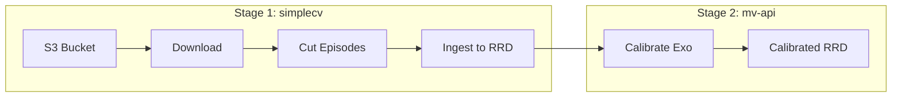
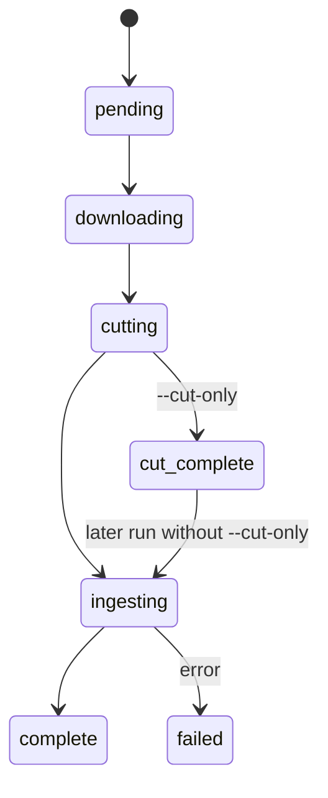
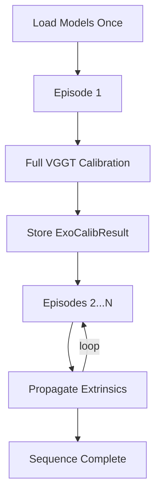

# ExoEgo Pipeline Walkthrough

Complete guide from S3 raw recordings → calibrated RRD files using official pipeline tools.

## Pipeline Overview



---

## Stage 1: Download, Cut, and Ingest (simplecv)

**Tool:** `batch_process_s3.py`  
**Repo:** simplecv

### What It Does
1. **Discovers** sequences with `episode_info.json` on S3
2. **Downloads** `synced/` folder and metadata
3. **Cuts** videos into episodes (GPU-accelerated AV1)
4. **Ingests** to RRD (videos, calibration, Quest telemetry)

### Commands

```bash
cd /home/pablo/0Dev/personal/simplecv

# Full pipeline: download → cut → ingest
pixi run -e gpu python tools/exoego_tools/batch_process_s3.py \
    --s3-bucket 87c3e07f-3661-4489-829a-ddfa26943cb3 \
    --profile pablo-sso \
    --output-dir /mnt/8tb/data/exoego-self-collected/quest+oak+exo/qwen-examples/cut

# Dry run first (show what would be done)
pixi run -e gpu python tools/exoego_tools/batch_process_s3.py \
    --s3-bucket 87c3e07f-3661-4489-829a-ddfa26943cb3 \
    --output-dir /path/to/output \
    --dry-run
```

### Mode Flags

| Flag | Description |
|------|-------------|
| (default) | Full pipeline: download → cut → ingest |
| `--cut-only` | Download + cut, skip RRD ingestion |
| `--reingest-only` | Only re-run ingestion on existing cut episodes |
| `--cleanup-synced` | Delete synced/ folder after cutting (saves disk) |

### State Machine



### Output Structure

```
<output_dir>/
├── manifest.json                    # Progress tracking
└── <date>/
    └── <sequence-id>/
        ├── episode_info.json
        ├── metadata.json
        ├── synced/                  # Raw videos (can cleanup)
        └── episodes/
            └── episode-001/
                ├── episode-001.rrd  # ← Ingested RRD
                ├── ego/
                ├── exo/
                └── quest/
```

---

## Stage 2: Exo Camera Calibration (mv-api)

**Tool:** `batch_exo_calib_client.py`  
**Repo:** mv-api

### What It Does
1. **Loads** multiview calibration models (VGGT, MoGe, RTMPose)
2. **Calibrates** first episode per sequence (full calibration)
3. **Propagates** extrinsics to remaining episodes (fast)
4. **Appends** calibration to existing RRD files (in-place)

### Commands

```bash
cd /home/pablo/0Dev/personal/mv-api

# Calibrate all sequences under a root directory
pixi run -e gpu python tools/batch_exo_calib_client.py \
    --cut-root /mnt/8tb/data/exoego-self-collected/quest+oak+exo/qwen-examples/cut

# Calibrate a single sequence
pixi run -e gpu python tools/batch_exo_calib_client.py \
    --sequence-path /path/to/date/sequence-id

# Dry run (discover without calibrating)
pixi run -e gpu python tools/batch_exo_calib_client.py \
    --cut-root /path/to/cut --dry-run
```

### Options

| Flag | Default | Description |
|------|---------|-------------|
| `--inplace` | True | Append to original RRD (fast) |
| `--no-inplace` | - | Create `-calibrated.rrd` copy (safe) |
| `--skip-tsdf-fusion` | True | Skip mesh fusion for speed |
| `--frame-selection` | middle | Which frame to calibrate |

### State Machine



### Output

- **calibration_manifest.json** per sequence (tracks success/error)
- Exo camera extrinsics appended to each episode RRD
- Cameras aligned to Quest ego world frame

---

## Complete Workflow

### Step 1: Ingest from S3

```bash
cd /home/pablo/0Dev/personal/simplecv

pixi run -e gpu python tools/exoego_tools/batch_process_s3.py \
    --s3-bucket 87c3e07f-3661-4489-829a-ddfa26943cb3 \
    --profile pablo-sso \
    --output-dir /mnt/8tb/data/exoego-self-collected/quest+oak+exo/qwen-examples/cut
```

### Step 2: Calibrate Exo Cameras

```bash
cd /home/pablo/0Dev/personal/mv-api

pixi run -e gpu python tools/batch_exo_calib_client.py \
    --cut-root /mnt/8tb/data/exoego-self-collected/quest+oak+exo/qwen-examples/cut
```

### Step 3: Verify

```bash
# Check simplecv manifest
cat /path/to/cut/manifest.json | jq '.sequences | to_entries | map(select(.value.status == "complete")) | length'

# Check calibration manifests
cat /path/to/cut/*/*/calibration_manifest.json | jq '.episodes | to_entries | map(select(.value.status == "success")) | length'

# View a calibrated RRD
pixi run rerun /path/to/episode-001/episode-001.rrd
```

---

## Why Custom Script Was Needed (Test Dataset)

The test dataset was created by **copying** files from `cut/` to `ingestion-test/`, not via S3 download. This meant:

1. **No manifest.json** in `ingestion-test/` (simplecv tracking)
2. Some sequences had cut videos but **no RRD files** yet
3. `batch_process_s3.py` needs S3 discovery to populate the manifest

For production use, always start from S3 with `batch_process_s3.py` - it handles everything correctly.

---

## Timing Estimates

| Stage | Time |
|-------|------|
| Download | ~15s per episode |
| Cut | ~56s per episode (8 videos × 7s GPU encode) |
| Ingest | ~10s per episode |
| Calibrate (first) | ~3-14s per episode |
| Propagate (rest) | ~3-5s per episode |

For 10 sequences (~56 episodes):
- **Ingestion**: ~22 minutes
- **Calibration**: ~15 minutes
